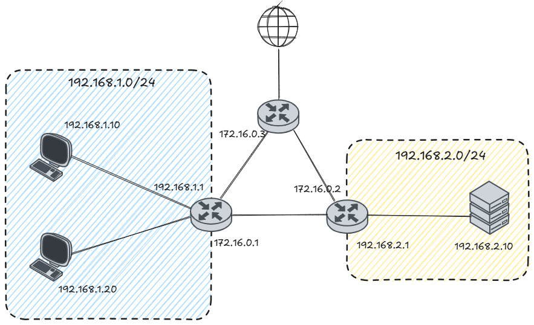

# Networking

## Instructions

Make the following network:



## Hints

### 1. Client configuration

For the client, configuration we do not need to configure special routes.

We will use `netplan` for this purpose.

`sudo netplan apply`

### 2. Router configuration

For the router, we will use `systemd-networkd`.

```bash
sudo mv /etc/netplan /etc/netplan.bak # Optional -> Deactivate netplan
```

Activate the _systemd-networkd_ service:

- `sudo systemctl start systemd-networkd`  
- `sudo systemctl enable systemd-networkd`

Create network config files:

`sudo nano /etc/systemd/network/[interface_name].network`

Ie :
```bash
[Match]
Name=[interface_name]

[Network]
Address=[cidr_device_ip]
Gateway=[gateway_ip]
DNS=[default_dns_ip]

[Route]
Destination=[network]
Gateway=[gateway_ip]

[Route]
Destination=[network]
Gateway=[gateway_ip]
```

Apply the changes with `sudo systemctl restart systemd-networkd`

Allow ip forwarding `sudo nano /etc/sysctl.conf` and uncomment `net.ipv4.ip_forward=1`
### 3. Nat rules

`sudo iptables -t nat -A POSTROUTING -o enp0s8 -j MASQUERADE`

### 4. Configure nginx server

`sudo apt install nginx`

`sudo systemctl start nginx`  
`sudo systemctl enable nginx`

Check if nginx is working `wget -O- localhost:80`

### 5. Reach the nginx server from the client

`wget -O- [server_ip_address]`