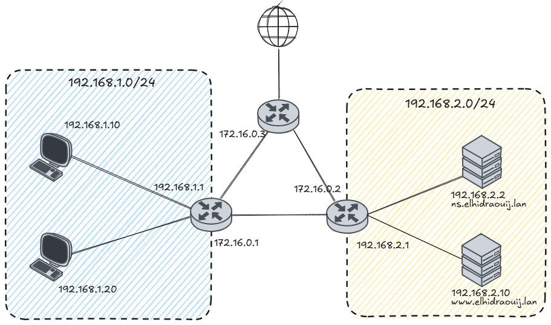

# Dns

## Instructions

Make the following network:



## Hints

### 1. DNS service installation

We will use `bind` to configure our DNS service

`sudo apt update` and `sudo apt install bind9 bind9-host bind9utils`

### 2. DNS configuration

#### a. Service configuration

To configure the dns service

`sudo nano /etc/bind/named.conf.options` and

```bash
options {
    directory "/var/cache/bind"; # Recently resolved name

    recursion yes; # Allow the dns server to ask for other domain name
    allow-query { # Allow query only from the following network
        192.168.1.0/24;
        192.168.2.0/24;
        172.16.0.0/24;
        # any; For any network
    }

    dnssec-validation auto;

    auth-nxdomain no; # conform to RFC1025
    listen-on { # Select the interfaces to expose the service
        127.0.0.1;
        192.168.2.2;
    }
}
```
#### b. Rules and zones configuration

`sudo nano /etc/bind/named.conf.local`

```bash
zone "elhidraouij.lan" {
    type master;
    file "/etc/bind/db.elhidraouij.lan";
}
```

#### c. Resource records

Now let's create the name to ip mapping in the `/etc/bind/db.elhidraouij.lan` file

To do so `sudo cp /etc/bind/db.local /etc/bind/elhidraouij.lan`, then `sudo nano /etc/bind/db.elhidraouij.lan`

```bash
$TTL 604800
@       IN  SOA     ns.elhidraouij.lan. admin.elhidraouij.lan. (
                2025062901 ; Serial (format AAAAMMJJnn)
                604800     ; Refresh
                86400      ; Retry
                2419200    ; Expire
                604800 )   ; Negative Cache TTL

        IN  NS      ns.elhidraouij.lan.

ns      IN  A       192.168.2.2
www     IN  A       192.168.2.10
```

#### d. Main resource records types

| Type | Description    |
|:----:|----------------|
| NS   | Name solver    |
| A    | Address (IPv4) |
| AAAA | Address (IPv6) |
| CNAME | Alias to another name |
| MX   | Mail Exchange  |


### 3. Reconfigure prefered DNS on machines

`sudo nano /etc/netplan/[config_file]`, to reconfigure the prefered dns server to `192.168.2.2` accordingly to our configuraion goal    
`sudo netplan apply`, to apply the changes

### 4. Try it out

`wget -O- www.elhidraouij.lan`, to verify our dns configuration

And `wget -O- www.google.com`, to verify the redirection

